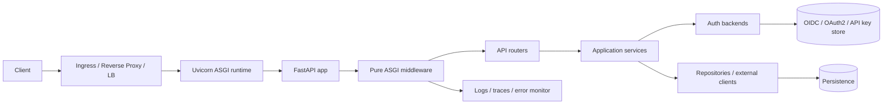
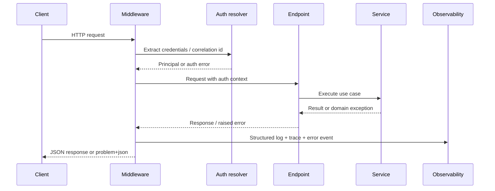

# Recommended Scaffold for a Uvicorn-Based Python REST API

## Executive summary

The strongest default recommendation is **FastAPI on top of Starlette, served by Uvicorn, validated with Pydantic v2, and configured through pydantic-settings**. That stack gives you the best balance of typed request/response contracts, dependency injection, OpenAPI generation, security primitives, and lower-level ASGI control. FastAPI explicitly centers type-hinted API development and dependency injection; Starlette provides the underlying ASGI toolkit, middleware model, authentication interfaces, and exception stack; and Uvicorn provides the ASGI runtime with tunable workers, event loop, protocol, timeouts, and concurrency limits.

For the Python runtime, your “latest stable 3.x” assumption currently resolves to **CPython 3.14.4** according to the entity["organization","Python Software Foundation","python org"] downloads page as of **April 16, 2026**. In production, pin a specific minor version and upgrade deliberately rather than following “latest” automatically.

Your concurrency target of **100 concurrent requests** is realistic **if the request path is predominantly non-blocking**: the asyncio event loop executes tasks cooperatively in a single thread, so blocking work directly in async handlers stalls other tasks; synchronous Starlette/FastAPI paths are shunted into a shared AnyIO thread pool whose default capacity is only **40 tokens**. That means the architectural priority is not “more threads everywhere,” but **async I/O end-to-end**, explicit offloading for blocking calls, and process-level scaling for CPU-heavy work.

My concrete recommendation is therefore:

1. **Framework**: FastAPI as the application surface, but use Starlette primitives where FastAPI intentionally stays thin.
2. **Runtime model**: async-first endpoint/service/repository code; no hidden blocking in request paths.
3. **Auth**: an internal `AuthBackend` protocol with adapters for JWT, OAuth2/OIDC introspection, and API keys; expose the resolved principal through a FastAPI dependency and optionally Starlette `request.user/request.auth`.
4. **Errors**: centralized exception hierarchy, RFC 9457 problem-details responses, pure ASGI middleware for correlation IDs and timing, JSON structured logs, plus error/performance instrumentation.
5. **Deployment**: one Uvicorn worker per container in Kubernetes; multiple workers only for single-host or non-clustered deployments; HPA, readiness/liveness/startup probes, and ingress/load-balancer enforced limits.

## Framework and architectural recommendation

The architectural objective is not merely “make a REST endpoint,” but “make a REST service that remains clean when authentication, observability, failure modes, and scale arrive.” In that context, **FastAPI is the best default**, **Starlette is the right underlying primitive layer**, and **Litestar is the most credible alternative if you want a different opinionated ASGI framework rather than a lower-level toolkit**.

| Option | What it is best at | Architectural implications | Recommendation |
|---|---|---|---|
| **FastAPI** | Typed request/response models, dependency injection, generated OpenAPI, built-in security helpers | Best productivity-to-control ratio for a modern REST API; ideal when you want explicit contracts and composable dependencies | **Recommended primary framework**. Official docs position it as a high-performance type-hinted API framework and describe DI/security primitives that map directly to authentication, validation, and service wiring.  |
| **Starlette** | Lightweight ASGI toolkit, middleware, authentication, request/response primitives, test client | Excellent for custom middleware/auth layers and low-level control; more manual assembly for large REST APIs | **Use as the primitive layer under FastAPI**, especially for auth middleware, pure ASGI middleware, and exception handling.  |
| **Litestar** | Batteries-included ASGI framework with plugins and DI | Viable alternative if you want a different framework rather than a toolkit+framework combination | **Reasonable alternative, not my default here**. Its docs emphasize plugins, DI, and high performance, but for this report’s requirements FastAPI+Starlette aligns more directly with the most widely documented patterns in the ASGI ecosystem.  |

The reason to recommend **FastAPI over raw Starlette** is not that Starlette is weaker. It is that FastAPI already solves the repetitive “API edge” work you would otherwise rebuild: request parsing, schema generation, dependency-driven composition, and security scheme exposure in OpenAPI. The reason to keep **Starlette visible in the design** is that the two places where production services usually need sharper control are **middleware** and **authentication**, and Starlette is where those core interfaces live.

The resulting architecture should be **ports-and-adapters oriented**:

- **API layer**: FastAPI routers, request/response schemas, dependency wiring.
- **Application layer**: orchestration/use-case services; no framework imports.
- **Domain layer**: business rules and domain exceptions.
- **Infrastructure layer**: auth backends, repositories, external clients, logging/tracing emitters.
- **Cross-cutting layer**: config, structured logging, error mapping, middleware, health checks.

That separation is what makes pluggable authentication and comprehensive error handling stay clean instead of leaking through every endpoint.

## Recommended concrete scaffold

The scaffold below is designed to keep the API edge thin, to make authentication and error handling replaceable, and to isolate blocking or stateful integrations from your endpoint functions.



This shape matches the documented strengths of FastAPI, Starlette, and Uvicorn: FastAPI handles the typed API surface and DI, Starlette supplies the middleware/auth/exception primitives, and Uvicorn supplies the ASGI serving model.

### Recommended file tree

```text
.
├── pyproject.toml
├── README.md
├── .env.example
├── Dockerfile
├── .github/
│   └── workflows/
│       ├── ci.yml
│       └── cd.yml
├── k8s/
│   ├── deployment.yaml
│   ├── service.yaml
│   ├── ingress.yaml
│   ├── hpa.yaml
│   └── networkpolicy.yaml
├── app/
│   ├── main.py
│   ├── api/
│   │   ├── router.py
│   │   ├── dependencies.py
│   │   └── v1/
│   │       ├── router.py
│   │       └── endpoints/
│   │           └── health.py
│   ├── core/
│   │   ├── config.py
│   │   ├── logging.py
│   │   ├── errors.py
│   │   ├── problem_details.py
│   │   └── lifespan.py
│   ├── middleware/
│   │   ├── request_context.py
│   │   ├── exception_mapping.py
│   │   └── access_log.py
│   ├── auth/
│   │   ├── base.py
│   │   ├── models.py
│   │   ├── resolver.py
│   │   └── backends/
│   │       ├── jwt.py
│   │       ├── oauth2_introspection.py
│   │       └── api_key.py
│   ├── services/
│   │   └── health_service.py
│   ├── domain/
│   │   ├── exceptions.py
│   │   └── models.py
│   ├── infra/
│   │   ├── observability/
│   │   │   ├── sentry.py
│   │   │   └── tracing.py
│   │   ├── repositories/
│   │   └── clients/
│   └── schemas/
│       ├── common.py
│       └── health.py
└── tests/
    ├── unit/
    ├── integration/
    ├── contract/
    └── load/
        ├── locustfile.py
        └── k6/
```

### Brief content descriptions

| Path | Responsibility |
|---|---|
| `app/main.py` | App factory, router registration, middleware registration, exception handlers |
| `app/core/config.py` | Typed settings using pydantic-settings; environment and secrets-file loading |
| `app/core/errors.py` | Base application exception classes and HTTP/problem mapping |
| `app/core/problem_details.py` | RFC 9457 response builder and error serializer |
| `app/middleware/request_context.py` | Correlation ID, timing, request-scoped context injection |
| `app/middleware/exception_mapping.py` | Pure ASGI middleware that normalizes uncaught exceptions into problem-detail responses and logs |
| `app/auth/base.py` | `Protocol`/interface for pluggable backends |
| `app/auth/resolver.py` | Backend orchestration: try JWT, OAuth2 introspection, API key, etc. |
| `app/auth/backends/*` | Concrete credential extract/validate/resolve implementations |
| `app/api/dependencies.py` | FastAPI dependency wrappers for principal, scopes, services |
| `app/services/*` | Application use cases; framework-agnostic orchestration |
| `app/domain/*` | Stable domain contract and exception hierarchy |
| `app/infra/observability/*` | Error monitor, tracing, exporters, log enrichment |
| `tests/unit` | Pure service/domain tests |
| `tests/integration` | ASGI/container/database boundary tests |
| `tests/contract` | Problem-details/auth/OpenAPI contract assertions |
| `tests/load` | 100-concurrency verification and regression checks |

### Minimal app factory

FastAPI’s DI system and Starlette’s middleware model make an application factory the most maintainable entrypoint, especially when environments, auth providers, and observability need to vary by deployment.

```python
# app/main.py
from contextlib import asynccontextmanager

from fastapi import FastAPI
from fastapi.middleware.cors import CORSMiddleware

from app.api.router import api_router
from app.core.config import Settings, get_settings
from app.core.errors import install_exception_handlers
from app.middleware.request_context import RequestContextMiddleware


@asynccontextmanager
async def lifespan(app: FastAPI):
    settings = get_settings()
    # initialize pools/clients here
    app.state.settings = settings
    yield
    # close pools/clients here


def create_app() -> FastAPI:
    settings: Settings = get_settings()

    app = FastAPI(
        title=settings.app_name,
        version=settings.app_version,
        lifespan=lifespan,
        docs_url="/docs" if settings.docs_enabled else None,
        redoc_url="/redoc" if settings.docs_enabled else None,
        openapi_url="/openapi.json" if settings.docs_enabled else None,
    )

    # Wrap globally so CORS headers are present on error responses too.
    app.add_middleware(RequestContextMiddleware)
    app.add_middleware(
        CORSMiddleware,
        allow_origins=settings.cors_allow_origins,
        allow_credentials=False,
        allow_methods=["GET", "POST", "PUT", "PATCH", "DELETE"],
        allow_headers=["Authorization", "Content-Type", "X-Request-ID"],
        expose_headers=["X-Request-ID"],
    )

    install_exception_handlers(app)
    app.include_router(api_router)

    return app


app = create_app()
```

### Pure ASGI middleware, not `BaseHTTPMiddleware`

For custom middleware such as request IDs, latency timers, auth context enrichers, or structured access logging, prefer **pure ASGI middleware** over `BaseHTTPMiddleware`. Starlette documents that `BaseHTTPMiddleware` interferes with `contextvars` propagation, whereas pure ASGI middleware preserves the lower-level ASGI contract and broader interoperability.

## Runtime tuning, concurrency planning, and deployment patterns

The concurrency model determines everything else. asyncio’s event loop runs tasks in a single thread; a task yields when it awaits. That is exactly why async APIs can handle many concurrent I/O waits efficiently, and exactly why careless blocking calls erase those gains. For blocking I/O you can offload to a thread; for CPU-heavy work, use processes or a separate worker system because the GIL still constrains threaded CPU parallelism in the typical runtime.

### Uvicorn tuning for a 100-concurrent target

| Setting | Recommended starting point | Why |
|---|---|---|
| `--workers` | **Single host**: `min(4, CPU cores)`; **Kubernetes**: `1` per pod | Uvicorn supports multiple worker processes; FastAPI’s container guidance recommends one Uvicorn process per container when replication is handled at the cluster level.  |
| `--loop` | `uvloop` on Linux, else `auto` | Uvicorn documents `uvloop` as higher performance but not compatible with Windows/PyPy.  |
| `--http` | `httptools` on Linux, else `auto` | Uvicorn documents `httptools` as higher performance.  |
| `--timeout-keep-alive` | `5` | This is Uvicorn’s default and is a sensible baseline for not tying up idle connections.  |
| `--timeout-graceful-shutdown` | `30` | Long enough for active in-flight requests during rolling deploys and pod termination. Uvicorn exposes this directly.  |
| `--backlog` | `2048` | Uvicorn’s documented default; appropriate starting point for bursty traffic.  |
| `--limit-concurrency` | `150–250` | Use as a **protective ceiling**, not an exact target. Uvicorn will return 503 when exceeded, which keeps memory usage bounded under abuse or sudden spikes.  |
| `--limit-max-requests` | `10000` with jitter `1000` | Useful for long-lived processes to mitigate slow memory growth; Uvicorn documents request-capped recycling and restart jitter.  |
| `--proxy-headers` + `--forwarded-allow-ips` | Enable, but trust only real proxy CIDRs | Correct client IP/scheme handling behind ingress/LB depends on trusted forwarded headers.  |
| `--no-server-header` | Enable in production | Uvicorn exposes server-header control; hiding framework/server detail is a sensible hardening default.  |

A concrete **single-host** starting command is:

```bash
uvicorn app.main:app \
  --host 0.0.0.0 \
  --port 8000 \
  --workers 4 \
  --loop uvloop \
  --http httptools \
  --proxy-headers \
  --forwarded-allow-ips=127.0.0.1,10.0.0.0/8 \
  --timeout-keep-alive 5 \
  --timeout-graceful-shutdown 30 \
  --backlog 2048 \
  --limit-concurrency 200 \
  --limit-max-requests 10000 \
  --limit-max-requests-jitter 1000 \
  --no-server-header
```

For **Kubernetes**, use **one worker per pod**, keep the rest of the runtime settings, and replicate horizontally. That aligns with FastAPI’s deployment guidance that cluster-level replication should replace per-container multi-worker management.

### Concurrency and resource planning

The practical meaning of “100 concurrent requests” depends on service time. Using Little’s Law as a planning tool:

- **100 concurrent** at **250 ms** average service time implies roughly **400 requests/sec**
- **100 concurrent** at **1 s** average service time implies roughly **100 requests/sec**

That is why you should size against **representative latency**, not only “number of concurrent requests.”

A usable starting model is:

| Workload shape | Starting deployment heuristic | Reasoning |
|---|---|---|
| Mostly async I/O, small JSON payloads | **2–4 Uvicorn workers total** across host/pods | Cooperative async concurrency is efficient for I/O waits; the main risk is hidden blocking, not raw connection count. Supported by the asyncio event-loop model and Uvicorn process workers.  |
| Sync dependencies or blocking SDKs in request path | Avoid if possible; otherwise tune thread offload very deliberately | Starlette’s shared threadpool defaults to **40 tokens**. If 100 concurrent requests all need blocking thread work, you will hit that ceiling unless you increase it, which also increases memory and scheduling overhead.  |
| CPU-heavy handlers | Prefer process offload / background worker system | `asyncio.to_thread()` is typically useful for I/O-bound functions only; CPU work should move to processes to avoid blocking and to sidestep the GIL.  |

For **memory**, do not trust generic internet numbers. Memory scales approximately with:

> **replicas × workers × per-process app RSS + connection buffers + client pools + observability overhead**

FastAPI’s container guidance is especially relevant here: a **single process per container** gives you a more stable, bounded per-container memory envelope, while multi-process containers multiply memory usage and complicate sizing.

### Deployment choice comparison

| Deployment pattern | Best fit | Recommendation |
|---|---|---|
| Single host, direct Uvicorn | Internal tools, low ops complexity | Fine for simple deployments; add a reverse proxy if exposed publicly. Uvicorn recommends a process manager and extra resilience for production/self-hosting.  |
| Single host, Nginx + Uvicorn workers | Moderate public production footprint | Strong option outside Kubernetes. Uvicorn documents Nginx as useful for resilience, buffering slow requests, and static/media handling.  |
| Gunicorn + Uvicorn worker | Traditional Unix process management | Still valid on self-hosted Linux, but note Uvicorn documents `uvicorn.workers` as deprecated and recommends the `uvicorn-worker` package instead.  |
| Docker Compose | One-server container deployment | Acceptable when you want container packaging without cluster orchestration; multi-worker containers can make sense here.  |
| Kubernetes | Horizontal scaling, rolling updates, health probes, autoscaling | **Recommended default when production scale/availability matters.** Use one worker per pod, ingress/service for traffic distribution, HPA, probes, and secrets/network policy.  |

For Kubernetes specifically, pair a `Deployment` with `Service`, `Ingress`, `HorizontalPodAutoscaler`, readiness/liveness/startup probes, and NetworkPolicies. Kubernetes documents HPA for CPU/memory/custom metrics, probes for health gating, Ingress for external HTTP/HTTPS access, and NetworkPolicies for L3/L4 traffic control.

If you need edge buffering, static asset handling, or public hardening on self-hosted infrastructure, a reverse proxy remains valuable. Uvicorn’s deployment guide explicitly notes Nginx can buffer slow requests and reduce load on the application processes; it also notes CDNs add significant DDoS protection.

## Error handling and observability

Your requirement for **comprehensive error handling** argues for a **layered strategy**, not scattered `try/except` blocks. The right model is:

- **domain exceptions** that mean stable business failures
- **application/infrastructure exceptions** for integration failures and timeouts
- **edge mappings** that convert those into a standard wire format
- **middleware-level logging and correlation**
- **out-of-band error/performance telemetry**

The best wire format here is **RFC 9457 Problem Details**. It standardizes a machine-readable error object for HTTP APIs, uses `application/problem+json`, and explicitly warns against exposing implementation internals in problem payloads.

Starlette’s exception model is well suited to this: handled exceptions travel through the normal middleware stack; unhandled errors should bubble all the way up so error logging middleware can log and re-raise. Starlette also documents the middleware order: `ServerErrorMiddleware`, installed middleware, `ExceptionMiddleware`, router, endpoints. FastAPI then adds convenient exception-handler registration and lets you override default handlers for `HTTPException` and `RequestValidationError`.

### Recommended exception hierarchy

```python
# app/core/errors.py
from dataclasses import dataclass
from http import HTTPStatus


@dataclass(slots=True)
class AppError(Exception):
    code: str
    message: str
    status_code: int = HTTPStatus.INTERNAL_SERVER_ERROR
    extra: dict | None = None


class ValidationFailed(AppError):
    def __init__(self, message: str, extra: dict | None = None):
        super().__init__(
            code="validation_failed",
            message=message,
            status_code=HTTPStatus.UNPROCESSABLE_ENTITY,
            extra=extra,
        )


class Unauthorized(AppError):
    def __init__(self, message: str = "Authentication required"):
        super().__init__(
            code="unauthorized",
            message=message,
            status_code=HTTPStatus.UNAUTHORIZED,
        )


class Forbidden(AppError):
    def __init__(self, message: str = "Insufficient permissions"):
        super().__init__(
            code="forbidden",
            message=message,
            status_code=HTTPStatus.FORBIDDEN,
        )


class UpstreamUnavailable(AppError):
    def __init__(self, message: str = "Upstream dependency unavailable"):
        super().__init__(
            code="upstream_unavailable",
            message=message,
            status_code=HTTPStatus.SERVICE_UNAVAILABLE,
        )
```

```python
# app/core/problem_details.py
from fastapi import Request
from fastapi.responses import JSONResponse

from app.core.errors import AppError


def problem_response(request: Request, exc: AppError) -> JSONResponse:
    body = {
        "type": f"https://docs.example.com/problems/{exc.code}",
        "title": exc.code.replace("_", " ").title(),
        "status": exc.status_code,
        "detail": exc.message,
        "instance": str(request.url.path),
        "code": exc.code,
        "request_id": getattr(request.state, "request_id", None),
    }
    if exc.extra:
        body["errors"] = exc.extra
    return JSONResponse(
        status_code=exc.status_code,
        content=body,
        media_type="application/problem+json",
    )
```

```python
# app/middleware/request_context.py
import logging
import time
import uuid
from typing import Callable, Awaitable

from starlette.types import ASGIApp, Scope, Receive, Send, Message

logger = logging.getLogger("app.access")


class RequestContextMiddleware:
    def __init__(self, app: ASGIApp) -> None:
        self.app = app

    async def __call__(self, scope: Scope, receive: Receive, send: Send) -> None:
        if scope["type"] != "http":
            await self.app(scope, receive, send)
            return

        request_id = str(uuid.uuid4())
        started = time.perf_counter()

        async def send_wrapper(message: Message) -> None:
            if message["type"] == "http.response.start":
                headers = list(message.get("headers", []))
                headers.append((b"x-request-id", request_id.encode()))
                message["headers"] = headers
            await send(message)

        scope.setdefault("state", {})
        scope["state"]["request_id"] = request_id

        try:
            await self.app(scope, receive, send_wrapper)
        finally:
            elapsed_ms = round((time.perf_counter() - started) * 1000, 2)
            logger.info(
                "request_complete",
                extra={
                    "request_id": request_id,
                    "path": scope.get("path"),
                    "method": scope.get("method"),
                    "elapsed_ms": elapsed_ms,
                },
            )
```

This middleware shape is intentionally **pure ASGI**, not `BaseHTTPMiddleware`, because Starlette documents `BaseHTTPMiddleware` context propagation limitations.

### Logging, monitoring, and tracing

Use the standard library’s `logging.config.dictConfig()` to install JSON-format application logs, and propagate a request ID through logs, responses, and problem-detail payloads. Python’s logging configuration API is built for dictionary-based configuration, which makes environment-specific logging setups straightforward.

For error and performance telemetry, add **one** of the following:

- **application monitoring** with entity["company","Sentry","software company"] for exception capture, transaction tracing, and middleware/DB/Redis visibility in a FastAPI app
- **distributed tracing** with OpenTelemetry if you already have an OTLP collector/observability stack

Sentry’s FastAPI documentation states that 5xx errors are captured by default, request data can be attached, performance transactions are supported, and both `StarletteIntegration` and `FastApiIntegration` can be configured. OpenTelemetry’s Python docs describe SDK-based manual instrumentation, while the Python ASGI/FastAPI instrumentors provide middleware-based request tracing.

One operational caveat matters: Starlette notes that if a background task raises **after** the response is already sent, the error handler still runs, but any replacement response is discarded. So background tasks are appropriate for **best-effort post-response work**, not for critical durable workflows such as billing, provisioning, or mandatory audit writes.



## Pluggable authentication and security posture

The correct auth design is **not** “pick one library and thread it through every route.” It is “define an internal authentication contract, implement adapters behind it, and expose a single principal/authorization dependency to the API layer.” That keeps authentication swappable while preserving endpoint ergonomics.

Starlette is especially useful here. Its `AuthenticationMiddleware` installs `request.user` and `request.auth`; backends implement `AuthenticationBackend.authenticate`; `AuthCredentials` exposes scopes; and `requires()` enforces permission scopes. FastAPI complements that with declarative security helpers that extract bearer tokens, API keys, OAuth2 flows, and OpenAPI security metadata.

### Recommended auth library and interface split

| Layer | Recommendation | Why |
|---|---|---|
| Internal auth contract | `typing.Protocol`-based backend interface | Keeps the application layer decoupled from JWT/OIDC/API-key vendor specifics. Mypy documents structural subtyping via protocols for exactly this kind of interface design.  |
| Wire extraction/OpenAPI integration | FastAPI security helpers | FastAPI provides `HTTPBearer`, `APIKeyHeader`, `APIKeyCookie`, OAuth2 helpers, and OpenAPI integration. `auto_error=False` is useful for optional or multi-mode auth.  |
| Middleware/session/auth context | Starlette AuthenticationMiddleware | Gives `request.user`, `request.auth`, scopes, and permissions.  |
| OAuth2/OIDC / JOSE | Authlib | Official docs describe OAuth2, OpenID Connect, JOSE, and framework integrations including Starlette/FastAPI clients.  |
| Local JWT validation only | PyJWT | Official docs describe JWT encode/decode, registered claims, JWKS retrieval, and OIDC examples. Good when you only need token verification, not full OAuth/OIDC workflows.  |

One important nuance: FastAPI’s `OpenIdConnect` helper is **only a stub for OpenAPI wiring** and does **not** implement the full OIDC scheme on its own. Do not mistake it for a complete OIDC resource-server solution.

### Minimal auth plugin interface

```python
# app/auth/base.py
from typing import Protocol

from app.auth.models import Principal, AuthContext


class AuthBackend(Protocol):
    name: str

    async def authenticate(self, auth_ctx: AuthContext) -> Principal | None:
        ...
```

```python
# app/auth/resolver.py
from collections.abc import Iterable

from app.auth.base import AuthBackend
from app.auth.models import AuthContext, Principal
from app.core.errors import Unauthorized


class AuthResolver:
    def __init__(self, backends: Iterable[AuthBackend]) -> None:
        self.backends = list(backends)

    async def authenticate(self, auth_ctx: AuthContext) -> Principal:
        for backend in self.backends:
            principal = await backend.authenticate(auth_ctx)
            if principal is not None:
                return principal
        raise Unauthorized()
```

```python
# app/api/dependencies.py
from typing import Annotated

from fastapi import Depends, Request
from fastapi.security import APIKeyHeader, HTTPBearer, HTTPAuthorizationCredentials

from app.auth.models import AuthContext
from app.container import get_auth_resolver

bearer = HTTPBearer(auto_error=False)
api_key = APIKeyHeader(name="X-API-Key", auto_error=False)


async def get_current_principal(
    request: Request,
    bearer_creds: Annotated[HTTPAuthorizationCredentials | None, Depends(bearer)],
    api_key_value: Annotated[str | None, Depends(api_key)],
):
    auth_ctx = AuthContext(
        request=request,
        bearer_token=bearer_creds.credentials if bearer_creds else None,
        api_key=api_key_value,
    )
    resolver = get_auth_resolver()
    return await resolver.authenticate(auth_ctx)
```

This design supports:

- **JWT validation** against local keys or JWKS
- **OAuth2/OIDC bearer tokens** via introspection or remote metadata/JWKS
- **API key** header or cookie backends
- **multiple optional auth modes** on the same endpoint, because FastAPI’s security helpers explicitly support `auto_error=False` for optional/multi-mode scenarios.

### Security best practices

**Input validation** should be strict on external boundaries. Pydantic’s default mode coerces values; strict mode reduces coercion and raises validation errors instead. Also set `extra='forbid'` on external request models so undeclared fields are rejected rather than silently ignored. Use pydantic-settings for config loading from environment variables or secrets files.

**CORS** should be explicit, not wildcarded, for browser clients. Starlette documents that `CORSMiddleware` defaults are restrictive and also recommends wrapping the whole application so even responses generated by outer error middleware still include the correct CORS headers.

**Host and HTTPS hardening** should include `TrustedHostMiddleware` and `HTTPSRedirectMiddleware` in self-hosted deployments. Starlette documents `TrustedHostMiddleware` as protection against Host header attacks and `HTTPSRedirectMiddleware` as enforcement of secure schemes.

**Proxy trust** must be explicit. Uvicorn’s proxy-header support only works safely when you configure trusted `forwarded-allow-ips`; do not trust all forwarded headers unless you truly control the entire path.

**Secrets management** should keep secrets out of code and out of images. Kubernetes Secrets exist for this purpose, but Kubernetes also cautions that Secrets are stored unencrypted in etcd by default unless you take additional precautions. That means “use Secrets” is necessary but not sufficient; combine it with etcd encryption, RBAC discipline, and ideally an external secret manager in serious environments.

**Container hardening** should use multi-stage builds, non-root runtime, and restricted pod/container security context. Docker documents multi-stage builds as a way to leave build tools behind in the final image. Kubernetes security context and Pod Security Standards document controls such as non-root execution, `allowPrivilegeEscalation: false`, seccomp/AppArmor, and read-only filesystems.

**Rate limiting** is best enforced at the edge: ingress controller, API gateway, CDN, or reverse proxy. In-application limits are still useful for tenant-specific semantics, but they should not be your only abuse-control layer. Uvicorn’s `--limit-concurrency` is a runtime safety valve, not a product-facing quota system.

## Testing, CI/CD, and deployment checklist

The testing strategy should mirror the architecture:

| Test layer | Tooling | What it proves |
|---|---|---|
| Unit | `pytest` | Domain services, auth backend behaviors, exception mapping, pure business rules. Pytest explicitly scales from small readable tests to larger functional suites.  |
| Integration | FastAPI `TestClient`, HTTPX ASGI transport | Router/dependency/middleware/auth behavior without a network hop. FastAPI’s testing docs are based on Starlette/HTTPX, and HTTPX documents `ASGITransport` for direct app calls.  |
| Async integration | `pytest` + AnyIO + `httpx.AsyncClient` | Async DB clients and lifespan-aware flows. FastAPI documents async tests and explains when `TestClient` is insufficient.  |
| Dependency override tests | `app.dependency_overrides` | Swap external integrations and auth providers cleanly in tests.  |
| Load | Locust or k6 | Verify the 100-concurrency target under representative auth/DB behavior. Locust is a Python-defined load-testing tool; k6 is geared toward load/reliability/performance testing with built-in metrics.  |

A good load suite should include at least:

- warm-up phase
- steady-state **100 concurrent users**
- a burst above target to verify `limit-concurrency`/503 behavior
- separate scenarios for unauthenticated, authenticated JWT, and API-key requests
- a slow dependency scenario to observe queueing, timeouts, and graceful degradation

For CI/CD, the default implementation on entity["company","GitHub","software company"] Actions is straightforward: GitHub’s official docs describe Actions as a CI/CD platform and provide a Python build-and-test workflow. A production-grade pipeline should run **Ruff**, **mypy**, **pytest**, integration tests, image build, dependency vulnerability audit, and a deploy job gated by environment protection or manual approval.

### CI/CD and deployment checklist

Use this as the concrete release gate:

- **Python/runtime**
  - Pin CPython **3.14.x**
  - Pin library versions and review upgrades deliberately
- **Code quality**
  - Run Ruff lint/format
  - Run mypy type checks, especially over auth protocols and dependency interfaces
- **Tests**
  - Unit, integration, async integration, dependency-override tests
  - Contract tests for problem-details payloads and auth failures
  - Load tests against the target 100 concurrency profile
- **Security**
  - Dependency audit with `pip-audit`
  - Secret scanning in your SCM platform
  - Confirm `extra='forbid'` and strict validation on inbound request models
  - Verify trusted proxy IPs and CORS allowlist are environment-specific
- **Container image**
  - Multi-stage build
  - Minimal final runtime image
  - Run as non-root where supported
  - Emit SBOM and provenance if your platform supports it
- **Kubernetes**
  - 1 worker per pod
  - readiness/liveness/startup probes
  - HPA on CPU/memory; custom metrics if available
  - secrets, network policies, restricted security context
  - rolling deployment with adequate graceful shutdown timeout
- **Observability**
  - JSON logs with request IDs
  - exception monitor enabled
  - traces exported
  - dashboards/alerts on 5xx, latency, saturation, auth failures, 503 limit-concurrency events

### Recommended concrete baseline

If I had to commit your initial production scaffold today, it would be this:

- **Framework**: FastAPI
- **Primitives**: Starlette middleware/auth/exception interfaces
- **ASGI server**: Uvicorn, async-first handlers
- **Python**: 3.14.4 pinned by minor/patch cadence
- **Auth**: internal `AuthBackend` protocol + adapters for JWT, OAuth2/OIDC, API key
- **Errors**: RFC 9457 problem-detail responses, central exception map
- **Logging/monitoring**: JSON logs + request IDs + traces + error monitor
- **Deployment**: Kubernetes, **1 Uvicorn worker per pod**, ingress/LB, HPA, probes
- **Validation/security**: Pydantic strict mode where it matters, `extra='forbid'`, explicit CORS allowlist, trusted proxy CIDRs only, host/HTTPS hardening, secrets outside code, restricted pod security context
- **Verification**: pytest + integration/contract tests + load tests proving the 100-concurrency target

That scaffold is opinionated, but it is opinionated in the direction of operational clarity, replacement-friendly authentication, and predictable failure behavior—the three traits that matter most once the service is no longer “just one endpoint.”
